# 🧾 Single-Page-CRUD
Create a simple one-page CRUD app using ASP.NET Core MVC
        

## ✅ Prerequisites

- ✅ Visual Studio 2022 installed
- ✅ .NET 8.0 or .NET 9.0 SDK installed

 

## 🛠️ Setup Instructions

### 1. Create Model
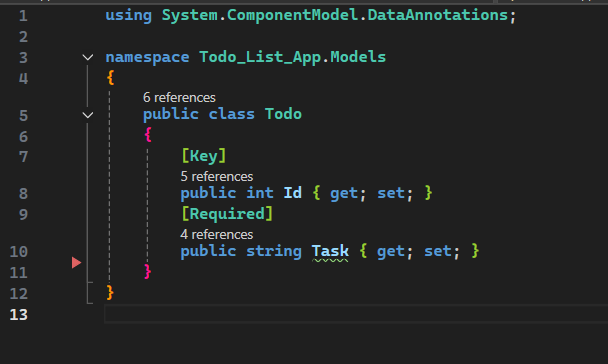

 

### 2. Create another model
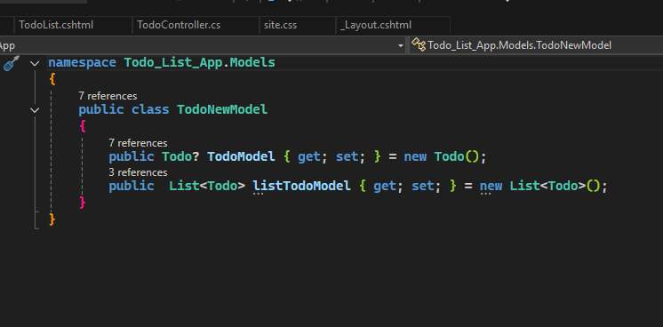
#### The TodoModel is for inserting data into the database,
#### while the TodoList is for handling or displaying the data in the table.

 
 

### 3. Set up View
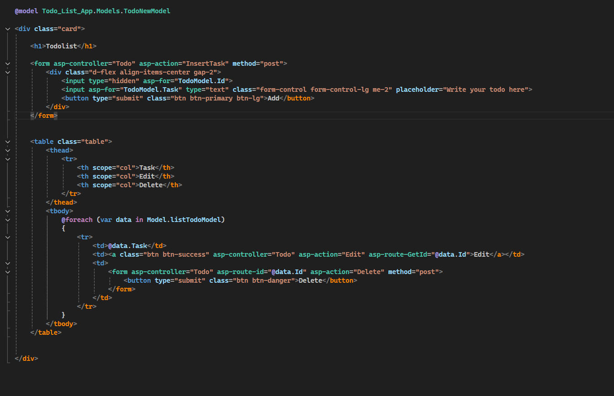

 
 

# About View
Here in the view, we have an 'Add data to database' section, and we also have a table where the data from the database will be stored.
### First, this is the code for inserting data into the database using the POST method.
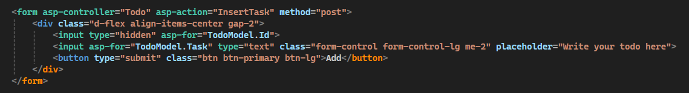

 

### Table code structure
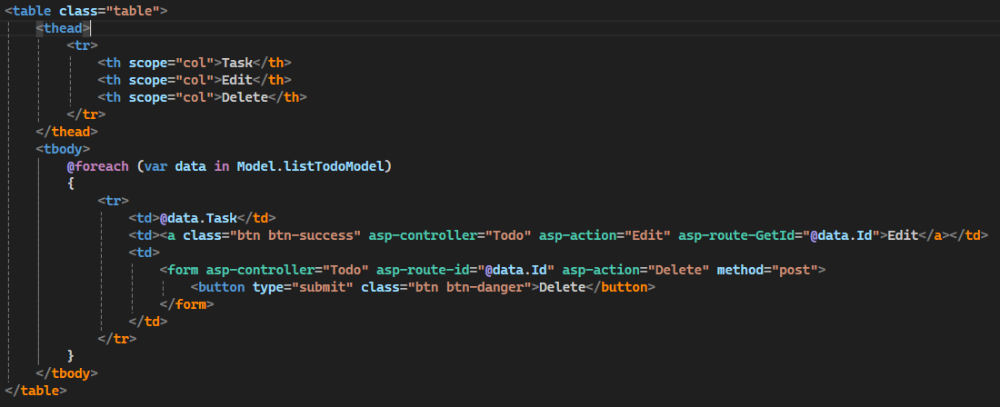

 

# Inside the tbody, we have a GET method for Edit and a POST method for Delete.
#### First, this is the one for Edit.

asp-route-GetId is parameter of Edit controller

 

#### Second, this is the one for Delete.
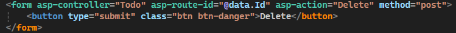

asp-route-id is parameter of Delete controller

 
 

# After you’ve set all of that up, here’s the logic in the controller.

### This is our InsertTask controller.
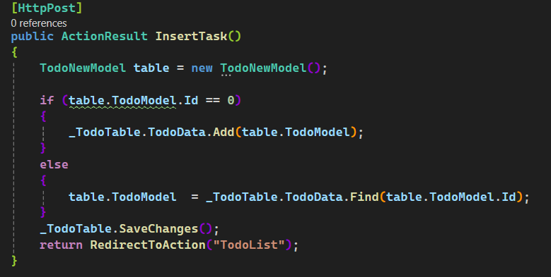

 

### This is the controller responsible for displaying the data in the table.
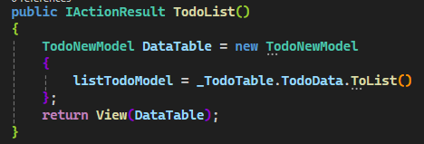

 

### This controller handles the editing of data.
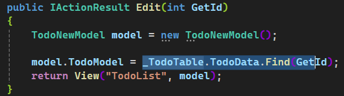

 

### This controller handles the deletion of data.
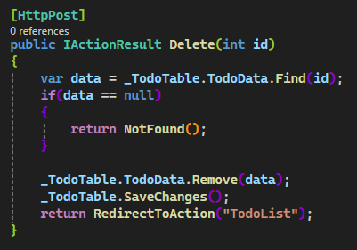

 

### Overall folder structure

 

 

# After you finish all of that, congratulations — you now have a single-page CRUD using ASP.NET Core MVC!

 

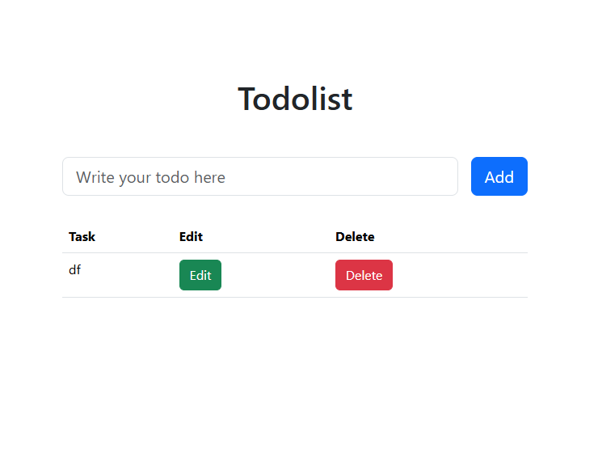

