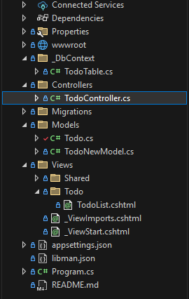

# 🧾 Single-Page-CRUD
Create a simple one-page CRUD app using ASP.NET Core MVC
        
---

## ✅ Prerequisites

- ✅ Visual Studio 2022 installed
- ✅ .NET 8.0 or .NET 9.0 SDK installed

---

## 🛠️ Setup Instructions

### 1. Create Model

---

### 2. Create another model

#### The TodoModel is for inserting data into the database, while the TodoList is for handling or displaying the data in the table.

### 3. Set up View

### About View
Here in the view, we have an 'Add data to database' section, and we also have a table where the data from the database will be stored.
### First, this is the code for inserting data into the database using the POST method.

### And this is the code for displaying the data in the table from the database

#### Inside the <tbody>, we have a GET method for Edit and a POST method for Delete.
#### First, this is the one for Edit.

asp-route-GetId is parameter of controller

#### Second, this is the one for Delete.

asp-route-id is parameter of controller

# After you’ve set all of that up, here’s the logic in the controller.

### This is our InsertTask controller.

### This, on the other hand, is the controller for displaying the data in the table.

### This one is the controller for editing the data.

### And this one is the controller for deleting the data.

### Overall folder structure

# After you finish all of that, congratulations — you now have a single-page CRUD using ASP.NET Core MVC!

